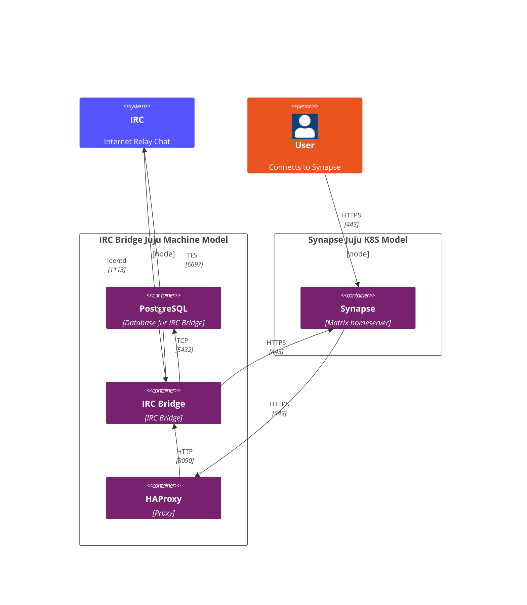
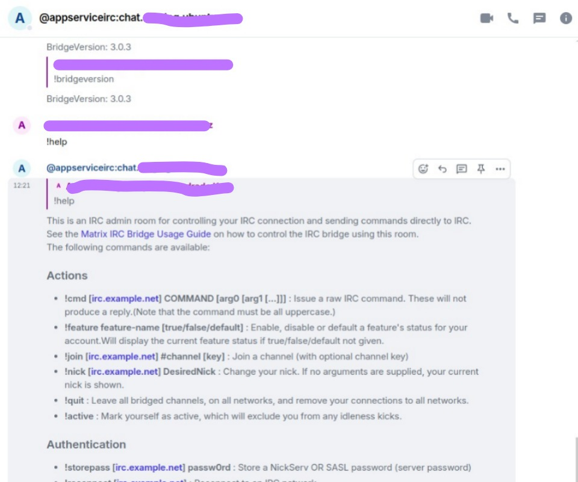

# IRC Bridge Operator

A [Juju](https://juju.is/) [charm](https://juju.is/docs/olm/charmed-operators)
deploying and managing an IRC Bridge (with Ident server) Integrator on bare metal.

This charm is meant to be used in conjunction with [Synapse](https://github.com/canonical/synapse-operator) and related
to it.



- User → Synapse: The user connects to the Matrix homeserver (Synapse) via HTTPS (port 443).
- Synapse → HAProxy: Synapse routes traffic to HAProxy via HTTPS (port 443).
- HAProxy → IRC Bridge: HAProxy forwards Matrix-IRC traffic to the bridge using HTTP (port 8090).
- IRC Bridge → IRC: The bridge connects to the IRC network using TLS (port 6697).
- IRC Bridge → PostgreSQL: It stores relevant data in PostgreSQL via TCP (port 5432).
- IRC Bridge ↔ Synapse: Maintains communication with Synapse over HTTPS (port 443).
- IRC → IRC Bridge: The IRC server connects back to the bridge via Identd (port 1113) for user identity verification.

The IRC Bridge is implemented as an Application Service, as defined in the Matrix
specification. This means it interacts with Synapse through the Application
Service API, allowing it to manage virtual users, handle messages, and bridge
communications between Matrix and IRC efficiently.

## Get started

IRC Bridge requires a PostgreSQL database and an integration with a Synapse server.

Also, since Synapse needs to interact with IRC Bridge, the charm should be
integrated with HAProxy exposing the application.

## Requirements

* A working station, e.g., a laptop, with amd64 architecture.
* Juju 3 installed and bootstrapped to a LXD and Microk8s controller. You can accomplish
this process by using a [Multipass](https://multipass.run/) VM as outlined in this guide: [Set up / Tear down your test environment](https://canonical-juju.readthedocs-hosted.com/en/3.6/user/howto/manage-your-deployment/manage-your-deployment-environment/#set-things-up)

:warning: When using a Multipass VM, make sure to replace IP addresses with the
VM IP in steps that assume you're running locally. To get the IP address of the
Multipass instance run ```multipass info my-juju-vm```.

### Set up a tutorial model

To manage resources effectively and to separate this tutorial's workload from
your usual work, create a new model using the following command.

```
juju add-model irc-bridge-tutorial
```

### Deploy IRC Bridge

```
juju deploy irc-bridge --channel edge
```

### Configure IRC Bridge

IRC Bridge has two mandatory configurations:

- bridge_admins: Matrix users that will be Bridge administrators.
- bot_nickname: nickname that will be used for creating the Bridge user.

Run the following command to set them.

```
juju configure irc-bridge bridge_admins=admin:example.com bot_nickname=ircappservice
```

### Deploy and integrate PostgreSQL

Run the following commands to deploy PostgreSQL charm and relate it to the IRC
Bridge charm.

```
juju deploy postgresql-k8s --channel 14/stable
juju integrate irc-bridge postgresql
```

### Deploy and integrate HAProxy

Synapse needs to communicate with IRC Bridge via an URL. The HAProxy charm will
be used as a proxy to expose the IRC bridge application.

Run the following command to deploy HAProxy and Self Signed Certificates.

```
juju deploy haproxy --channel 2.8/edge
juju deploy self-signed-certificates
juju integrate haproxy self-signed-certificates
juju integrate irc-bridge haproxy
```

### Deploy Synapse in MicroK8s controller

Switch to the MicroK8S controller and refer to the [Synapse Getting Started](https://charmhub.io/synapse/docs/tutorial-getting-started) tutorial for step-by-step instructions.

To switch, run the following command:

```
juju switch microk8s-localhost
```

:warning: microk8s-localhost is the Microk8s controller.

The command `juju controllers` list all the existings controllers in the environment.

### Create the bridge admin user

The user set in the `bridge_admins` should be created in Synapse and will be used
for managing the bridge.

```
juju run-action synapse/0 register-user username=admin admin=yes
```

Save the password since will be used in further steps.

### Create an offer

Since IRC Bridge is running in a different model, the integration between them
should be done via an [Offer](https://canonical-juju.readthedocs-hosted.com/en/latest/user/reference/offer/#offer).

The following command will expose the Matrix Auth endpoint, allowing other
applications to integrate with it.

```
juju offer synapse:matrix-auth
```

### Integrate IRC Bridge with Synapse

Now that Synapse is set, change it back to the LXD controller.

```
juju switch localhost-localhost
```

:warning: localhost-localhost is the LXD controller.

The command `juju controllers` list all the existings controllers in the environment.

```
juju integrate irc-bridge microk8s-localhost:admin/synapse.matrix-auth
```

### Check health endpoint

The IRC Bridge charm will configure the IRC Bridge once the integration is in
place. Check if the charm is active and idle using `juju status` command.

Then, find the HAProxy unit IP address and check if the /health endpoint returns
OK. This indicates that the IRC Bridge is active.

```
curl https://<HAProxy unit IP address>/irc-bridge-tutorial-irc-bridge/health
OK
```

### Interact with the bridge

Access Synapse via Element with the admin user created previously.

To interact with the Bridge, you can invite the user "ircappservice" to a room or sent a message.

Send a message to the user (if a warning shows up, ignore and proceed) ircappservice.

The Bridge will show a help menu with all the options available. Try the following to guarantee
that the bridge is working.

```
!bridgeversion
```

To check all available options, send the following command:

```
!help
```

Screenshot example:



### Join a IRC channel

You can use send a message to the user "ircappservice" like `!join #python` and
this will be interpreted as a command to join the #python channel.

After this, you can join the room python that corresponds to the IRC python channel.

## Integrations

- [HAProxy](https://charmhub.io/haproxy): HAProxy is a TCP/HTTP reverse proxy which is particularly suited for high availability environments.
- [Postgresql](https://charmhub.io/postgresql): PostgreSQL is a powerful, open source object-relational database system.
- [Synapse](https://charmhub.io/synapse): Synapse is an open-source Matrix homeserver developed from 2019 through 2023 as part of the Matrix.org Foundation. Briefly, Matrix is an open standard for communications on the internet, supporting federation, encryption and VoIP.

## Learn more
* [Read more](https://charmhub.io/irc-bridge)
* [Developer documentation](https://github.com/matrix-org/matrix-appservice-irc/blob/develop/CONTRIBUTING.md)
* [Official webpage](https://github.com/matrix-org/matrix-appservice-irc/tree/develop)
* [Troubleshooting](docs/how-to/troubleshooting.md)

## Project and community
* [Issues](https://github.com/canonical/irc-bridge-operator/issues)
* [Contributing](https://charmhub.io/irc-bridge/docs/contributing)
* [Matrix](https://matrix.to/#/#charmhub-charmdev:ubuntu.com)
