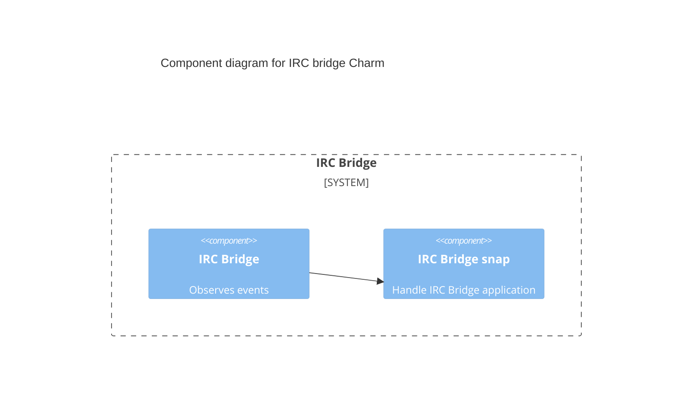

# Charm architecture

The IRC Bridge facilitates communication between Matrix (Synapse) and IRC by
acting as a bridge. It runs on a Juju model alongside HAProxy (load balancer)
and PostgreSQL (database).

IRC Bridge is installed as a Snap in the Juju Machine unit and the charm
interacts with it when the required integrations are set.

1. The Charm is deployed.
2. The Charm checks for database integration; if none is found, it transitions
to a blocked state.
3. The Charm checks for Matrix authentication integration; if none is found, it
transitions to a blocked state.
4. The Charm validates the configuration; if invalid, it transitions to a
blocked state.
5. If Ident is enabled, the Ident port is configured to be exposed.
6. Once all integrations and validations are complete, the Charm installs the
Snap and generates the necessary configuration.
7. From the Matrix authentication integration, the Charm creates the IRC
registration file and shares it with Synapse, which then registers the IRC Bridge as an application service.

## IRC Bridge Snap

The IRC Bridge Snap is utilized to package and distribute [matrix-appservice-irc](https://github.com/matrix-org/matrix-appservice-irc),
providing a consistent, secure and maintainable deployment across various
environments. By leveraging [Snap](https://snapcraft.io/about), the application benefits from simplified
installation, automatic updates and dependency isolation.

For more details or to participate in its development, please refer to the
[GitHub repository](https://github.com/canonical/matrix-appservice-irc).

## Charm code overview

The `src/charm.py` is the default entry point for a charm and has the
`IRCCharm` Python class which inherits from the `CharmBase`.

CharmBase is the base class from which all Charms are formed, defined by [Ops](https://juju.is/docs/sdk/ops)
(Python framework for developing charms).

See more information in [Charm](https://canonical-juju.readthedocs-hosted.com/en/3.6/user/reference/charm/).

The `__init__` method guarantees that the charm observes all events relevant to
its operation and handles them.

Note that the IRC Bridge is a machine charm, meaning it may differ from a
Kubernetes charm in various ways.
You can learn more about this in the [Charm Taxonomy](https://canonical-juju.readthedocs-hosted.com/en/latest/user/reference/charm/charm-taxonomy/#machine).
