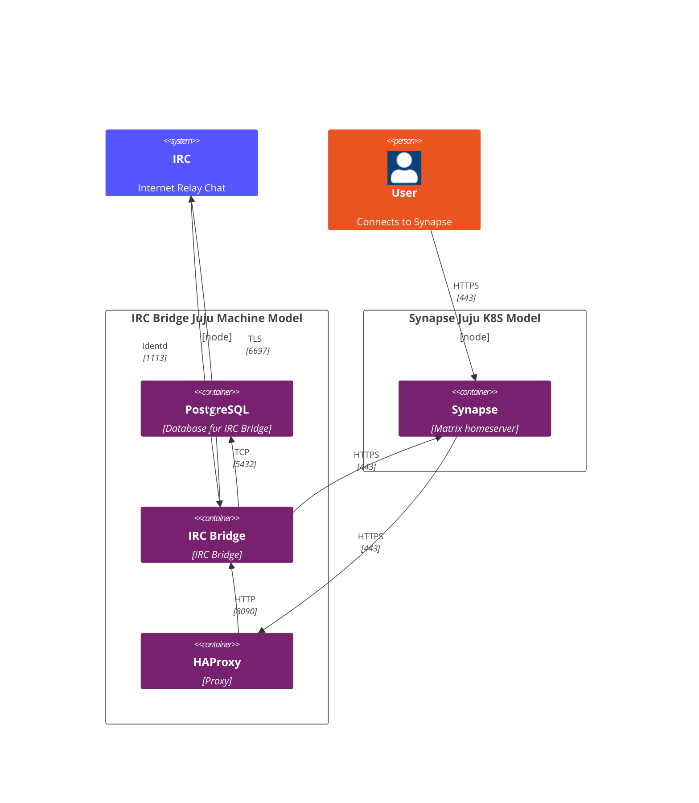

# IRC bridge operator

A [Juju](https://juju.is/) [charm](https://documentation.ubuntu.com/juju/3.6/reference/charm/)
deploying and managing an IRC Bridge (with Ident server) Integrator on bare metal.

This charm is meant to be used in conjunction with [Synapse](https://github.com/canonical/synapse-operator) and related
to it.

## High-level overview of IRC Bridge

The IRC Bridge is implemented as an Application Service, as defined in the Matrix
specification. This means it interacts with Synapse through the Application
Service API, allowing it to manage virtual users, handle messages and bridge
communications between Matrix and IRC efficiently.

Integrations overview:

- User → Synapse: The user connects to the Matrix home server (Synapse) via HTTPS (port 443).
- Synapse → HAProxy: Synapse routes traffic to HAProxy via HTTPS (port 443).
- HAProxy → IRC Bridge: HAProxy forwards Matrix-IRC traffic to the bridge using HTTP (port 8090).
- IRC Bridge → IRC: The bridge connects to the IRC network using TLS (port 6697).
- IRC Bridge → PostgreSQL: It stores relevant data in PostgreSQL via TCP (port 5432).
- IRC Bridge ↔ Synapse: Maintains communication with Synapse over HTTPS (port 443).
- IRC → IRC Bridge: The IRC server connects back to the bridge via Ident (port 1113) for user identity verification.

## Get started

To begin, refer to the [tutorial](tutorial/deploy-irc-bridge.md) for step-by-step instructions.

## Integrations

- [HAProxy](https://charmhub.io/haproxy): HAProxy is a TCP/HTTP reverse proxy which is particularly suited for high availability environments.
- [PostgreSQL](https://charmhub.io/postgresql): PostgreSQL is a powerful, open source object-relational database system.
- [Synapse](https://charmhub.io/synapse): Synapse is an open-source home server that is part of the Matrix.org Foundation. Matrix is an open standard for communications on the internet, supporting federation, encryption and VoIP.

## Learn more
* [Read more](https://charmhub.io/irc-bridge)
* [Developer documentation](https://github.com/matrix-org/matrix-appservice-irc/blob/develop/CONTRIBUTING.md)
* [Official webpage](https://github.com/matrix-org/matrix-appservice-irc/tree/develop)
* [Troubleshooting](how-to/troubleshooting.md)

## Project and community
* [Issues](https://github.com/canonical/irc-bridge-operator/issues)
* [Contributing](https://github.com/canonical/irc-bridge-operator/blob/main/CONTRIBUTING.md)
* [Matrix](https://matrix.to/#/#charmhub-charmdev:ubuntu.com)

# Contents

1. [Tutorial](tutorial/deploy-irc-bridge.md)
1. [How To](how-to)
  1. [Troubleshooting](how-to/troubleshooting.md)
  1. [Contribute](how-to/contribute.md)
1. [Explanation](explanation)
  1. [Charm architecture](explanation/charm-architecture.md)
